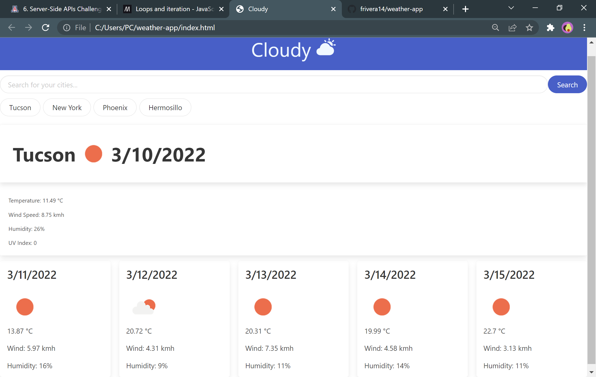

# weather-app

This weather app uses openweathermap API to retrieve weather data for cities of preference.

The app uses local storage to be able to retrieve recently viewed cities. 

https://github.com/frivera14/weather-app
https://frivera14.github.io/weather-app/

